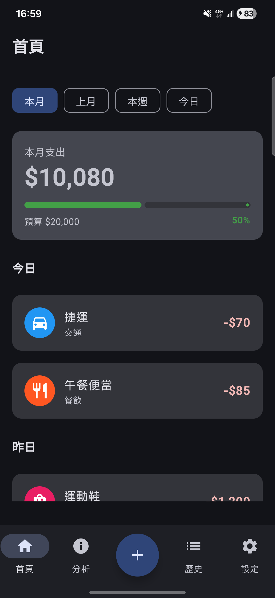
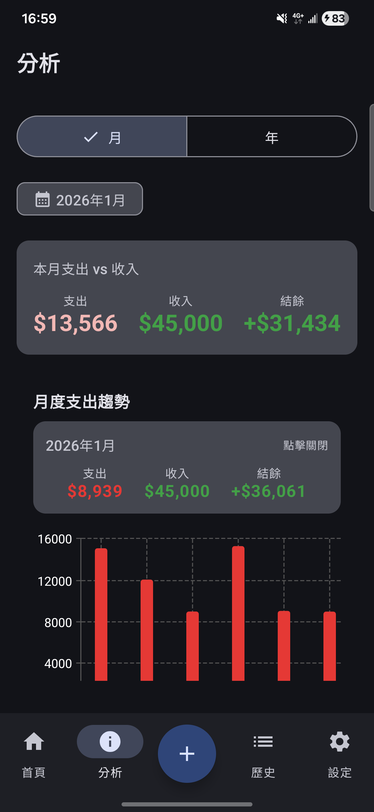
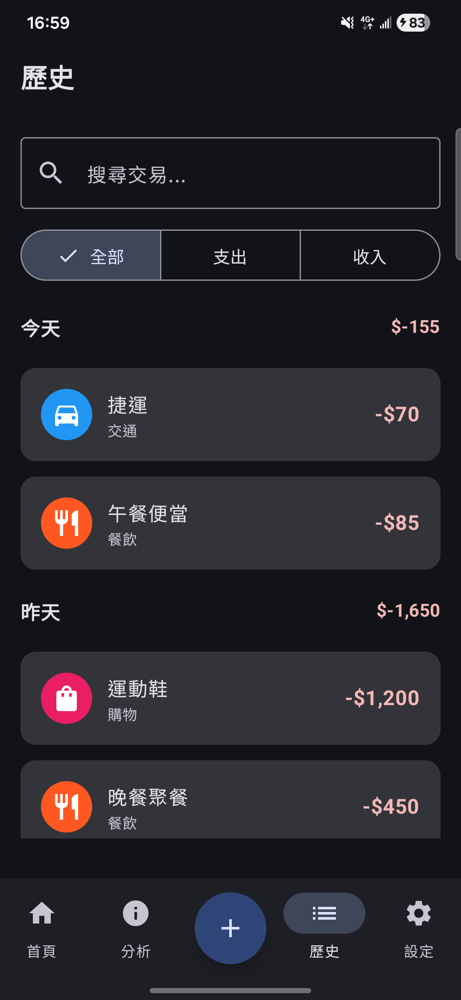
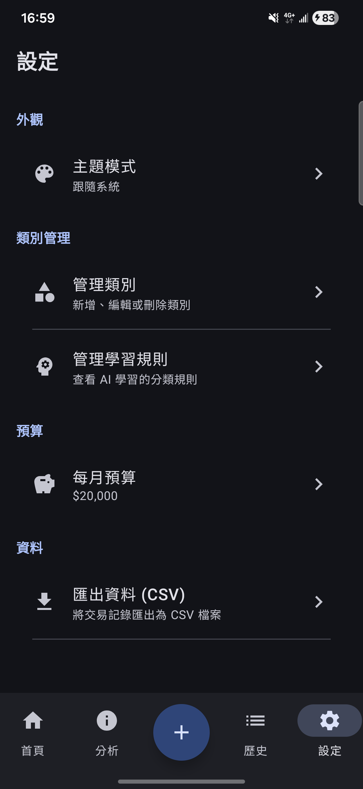
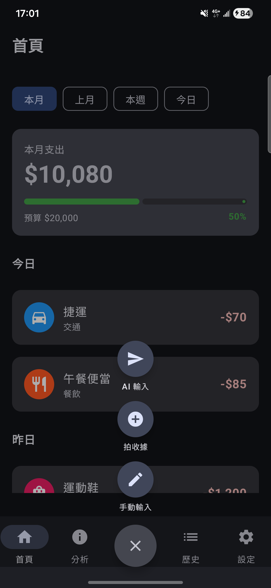

# MoneyMind

AI 驅動的個人記帳 Android 應用，透過自然語言輸入和收據掃描，讓記帳變得像跟朋友說話一樣簡單。

## 功能特色

### 核心功能
- **自然語言記帳** - 輸入「午餐便當 85」即可自動解析並記錄
- **收據掃描** - 拍照掃描收據，AI 自動辨識金額和商家
- **智慧分類** - AI 自動分類交易，越用越準確
- **語音輸入** - 支援語音轉文字記帳

### 資料分析
- **圓餅圖** - 類別支出分佈視覺化
- **長條圖** - 每日支出趨勢
- **折線圖** - 月度支出趨勢
- **時間篩選** - 日/週/月/年 視圖切換

### 使用者體驗
- **下拉刷新** - 首頁和歷史頁支援下拉刷新
- **空狀態提示** - 優雅的空資料顯示
- **轉場動畫** - 流暢的頁面切換效果
- **深色模式** - 支援系統/淺色/深色主題切換
- **預算追蹤** - 設定月預算並追蹤進度

## 技術架構

### 技術棧
| 項目 | 技術 |
|------|------|
| 語言 | Kotlin |
| UI | Jetpack Compose + Material 3 |
| 架構 | MVVM + Clean Architecture |
| 資料庫 | Room |
| DI | Hilt |
| AI | Google Gemini API |
| OCR | ML Kit (備用) / Gemini Vision |
| 圖表 | Vico + 自製 Canvas |

### 專案結構
```
app/src/main/java/com/bianca/moneymind/
├── di/                     # Dependency Injection
│   ├── DatabaseModule.kt
│   ├── NetworkModule.kt
│   └── RepositoryModule.kt
├── data/                   # Data Layer
│   ├── local/
│   │   ├── dao/           # Room DAOs
│   │   ├── database/      # AppDatabase
│   │   ├── datastore/     # Settings DataStore
│   │   ├── entity/        # Room Entities
│   │   └── mapper/        # Entity <-> Domain mappers
│   ├── remote/
│   │   ├── gemini/        # Gemini AI Service
│   │   └── ocr/           # ML Kit OCR Service
│   └── repository/        # Repository Implementations
├── domain/                 # Domain Layer (Pure Kotlin)
│   ├── model/             # Domain Models
│   ├── repository/        # Repository Interfaces
│   └── usecase/           # Use Cases
│       └── ai/            # AI-related Use Cases
├── presentation/           # UI Layer
│   ├── analysis/          # 分析頁面 + 圖表
│   ├── camera/            # 相機拍照
│   ├── chat/              # 自然語言輸入
│   ├── components/        # 共用元件
│   ├── edit/              # 編輯交易
│   ├── history/           # 歷史記錄
│   ├── home/              # 首頁
│   ├── main/              # 主畫面框架
│   ├── manual/            # 手動輸入
│   ├── settings/          # 設定頁面
│   └── util/              # 工具類
├── navigation/             # Navigation
└── ui/theme/              # Material 3 Theme
```

## 快速開始

### 環境需求
- Android Studio Hedgehog (2023.1.1) 或更新版本
- JDK 11+
- Android SDK 29+ (Android 10)

### 設定步驟

1. **Clone 專案**
   ```bash
   git clone <repo-url>
   cd MoneyMind
   ```

2. **設定 Gemini API Key**

   在專案根目錄的 `local.properties` 加入：
   ```properties
   GEMINI_API_KEY=your_api_key_here
   ```

   > 取得 API Key: https://ai.google.dev/

3. **開啟 Android Studio**
   - File → Open → 選擇 MoneyMind 資料夾
   - 等待 Gradle sync 完成

4. **執行應用**
   - 連接 Android 裝置或啟動模擬器
   - 點擊 Run 按鈕

### 編譯指令
```bash
# Debug 版本
./gradlew assembleDebug

# Release 版本
./gradlew assembleRelease
```

## 權限說明

| 權限 | 用途 |
|------|------|
| `CAMERA` | 收據拍照掃描 |
| `RECORD_AUDIO` | 語音輸入記帳 |
| `INTERNET` | Gemini API 連線 |

## 設計文件

詳細設計文件位於 `docs/` 資料夾：

| 文件 | 內容 |
|------|------|
| [README.md](docs/README.md) | 產品概述 |
| [ARCHITECTURE.md](docs/ARCHITECTURE.md) | 技術架構 |
| [DATA_MODEL.md](docs/DATA_MODEL.md) | 資料模型 |
| [AI_FEATURES.md](docs/AI_FEATURES.md) | AI 功能設計 |
| [UI_DESIGN.md](docs/UI_DESIGN.md) | UI/UX 設計 |
| [ROADMAP.md](docs/ROADMAP.md) | 開發進度 |

## 開發進度

| Phase | 名稱 | 狀態 |
|-------|------|------|
| 0 | 專案初始化 | ✅ 完成 |
| 1 | 資料層 | ✅ 完成 |
| 2 | 基礎 UI + 手動記帳 | ✅ 完成 |
| 3 | AI 功能整合 | ✅ 完成 |
| 4 | OCR 收據掃描 | ✅ 完成 |
| 5 | 分析與圖表 | ✅ 完成 |
| 6 | 設定與收尾 | ✅ 完成 |

## 截圖

### 首頁


### 分析


### 歷史


### 設定


### 輸入選單


### 圓餅圖


## 授權

此專案僅供學習與展示用途。

---

Built with Kotlin + Jetpack Compose
